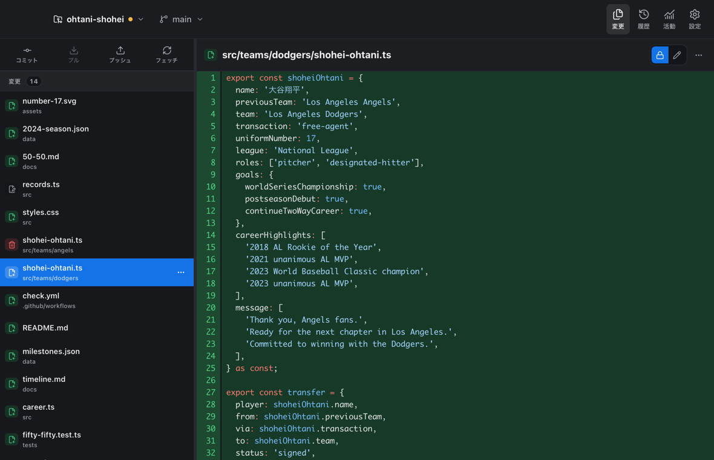
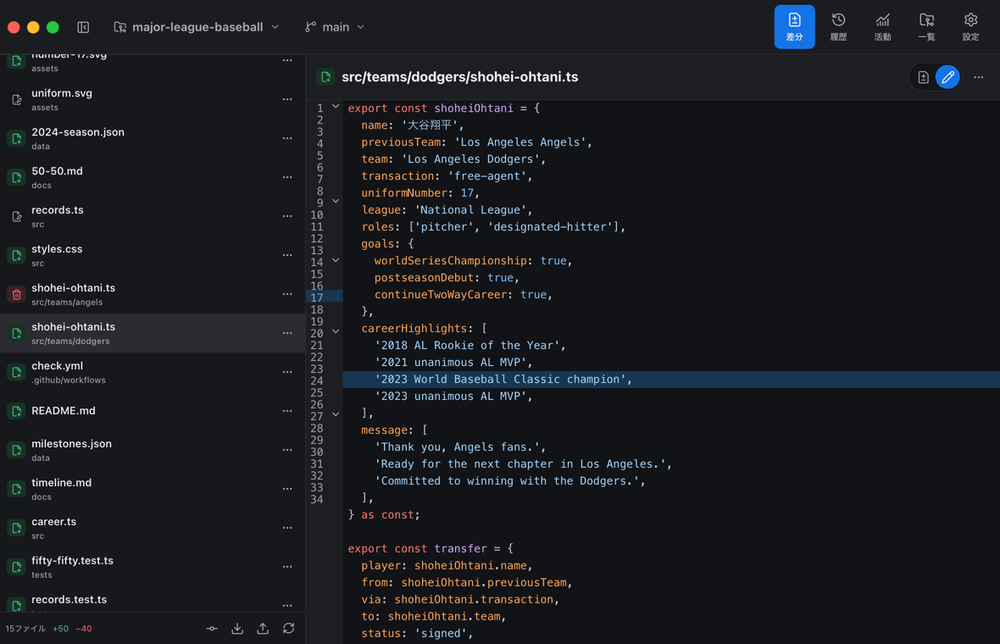
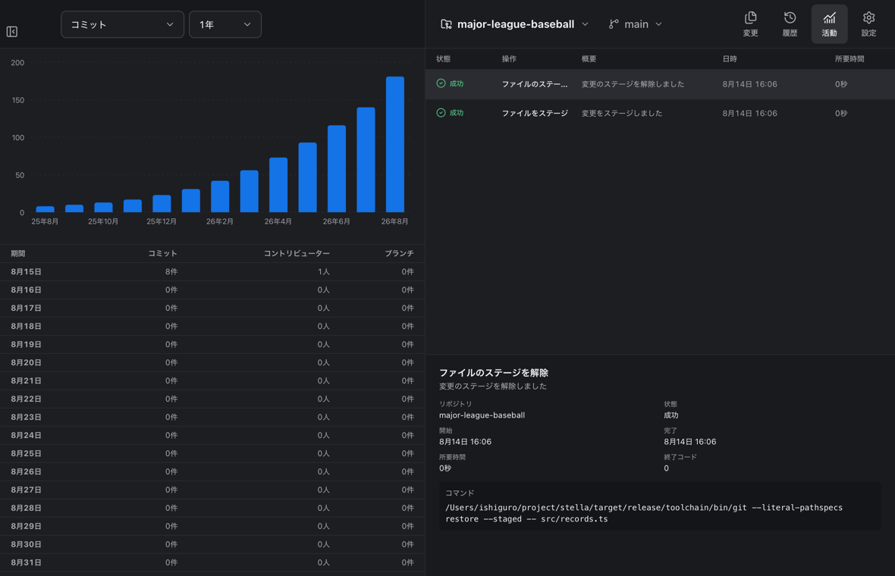
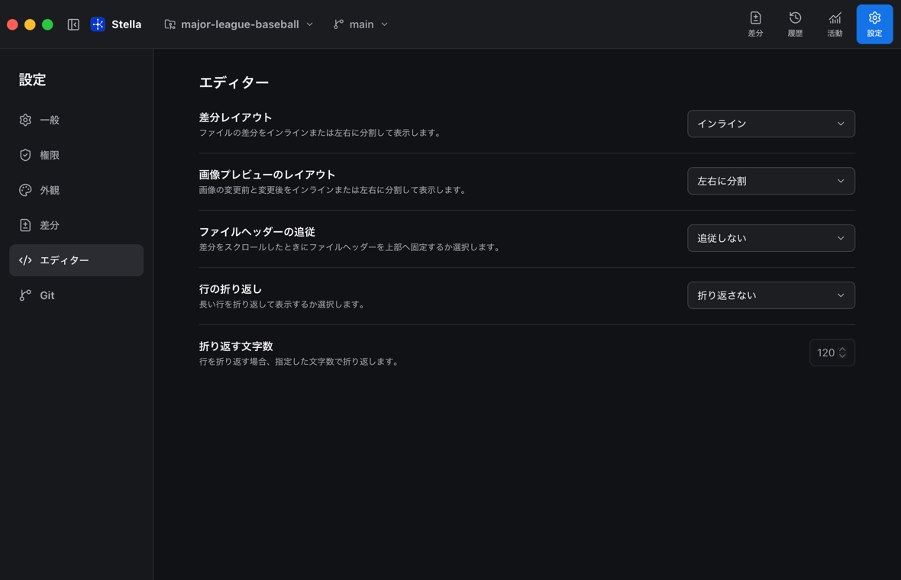

<h1 align="center">Stella</h1>

<p align="center">
  
</p>

<p align="center">
  人よりAIがコードを書く時代のシンプルなGitクライアント<br>
  Gitクライアントをほぼレビューでしか使わない人向け
</p>

> [!WARNING]
> このアプリは現在α版です。  
> 将来的に破壊的な変更が入る可能性があります。  
> 操作やバグによって生じた損害について、作者は一切の責任を負いません。  

## ✨ 機能

### 変更

ファイル、ハンク、行の単位で差分を確認・編集することができます。





### 履歴

コミット、ブランチ、タグを確認・検索することができます。


### 活動

コミット数、コントリビューター数、ブランチ数の推移を閲覧できます。



### 設定

言語や外観、文字サイズ、画面用・コード用フォント、差分、ステージの表示などを好みに合わせて設定できます。



## 📦 インストール

```sh
brew install --cask ishiguro-junya/tap/stella
```

## 🌱 はじめる

```sh
mise install
mise run setup
mise run dev
```

開発用リポジトリの`origin`にはローカルのbareリポジトリを使用し、GitHubやネットワークへは接続しません。
`mise run reset`を実行すると、作業内容とローカルremoteをまとめて初期状態へ戻します。

## 🧰 コマンド

| コマンド | 内容 |
| --- | --- |
| `mise run setup` | 開発環境をセットアップする。 |
| `mise run dev` | アプリを開発モードで起動する。 |
| `mise run build` | アプリをビルドする。 |
| `mise run install` | アプリをインストールする。 |
| `mise run lint` | コードをリントチェックする。 |
| `mise run format` | コードをフォーマットする。 |
| `mise run typecheck` | コードの型チェックを実行する。 |
| `mise run test` | ユニットテストを実行する。 |
| `mise run test:e2e` | E2Eテストを実行する。 |
| `mise run screenshot` | スクリーンショットを生成する。 |
| `mise run reset` | 開発用リポジトリを初期状態へ戻す。 |

## 📁 ディレクトリ構成

```text
.
├── src/                    # 画面と操作を実装するReact / TypeScriptコード
│   ├── adapters/           # Tauriとの通信
│   ├── domain/             # Gitの型とルール
│   ├── features/           # 機能ごとの画面と操作
│   ├── i18n/               # 多言語の制御
│   ├── persistence/        # アプリ設定の保存
│   ├── test/               # ユニットテスト
│   ├── theme/              # 外観テーマの制御
│   └── ui/                 # 共通UIコンポーネント
├── src-tauri/              # Git操作とTauriの設定
├── tests/                  # E2Eテストのコード
├── scripts/                # スクリプト
└── docs/                   # ドキュメント
```

## 📚 ドキュメント

- [仕様](docs/specification.md)
- [アーキテクチャ](docs/architecture.md)
- [デザイン](DESIGN.md)
- [サードパーティーに関する通知](THIRD_PARTY_NOTICES.md)
- [リリース手順](docs/release.md)

## 🔗 参考リンク

- [mise](https://mise.jdx.dev/)
- [tsx](https://github.com/privatenumber/tsx)
- [Tauri](https://github.com/tauri-apps/tauri)
- [Oxc](https://oxc.rs/)
- [markdownlint-cli2](https://github.com/DavidAnson/markdownlint-cli2)
- [Lychee](https://github.com/lycheeverse/lychee)
- [Lefthook](https://lefthook.dev/)
- [Homebrew](https://brew.sh/ja/)

## ⚖️ ライセンス

[Sustainable Use License 1.0](LICENSE)
