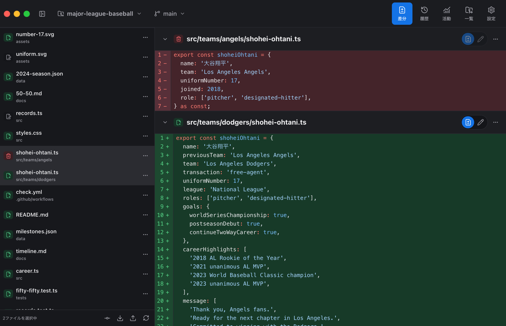
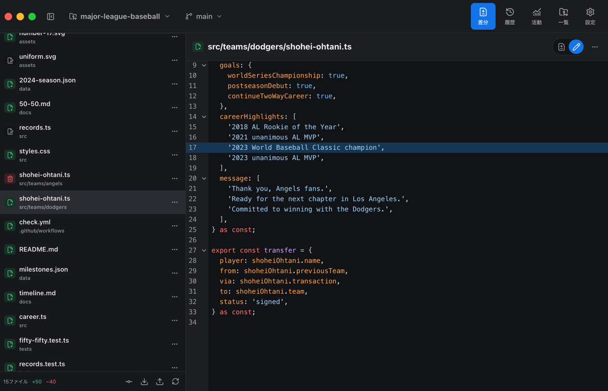
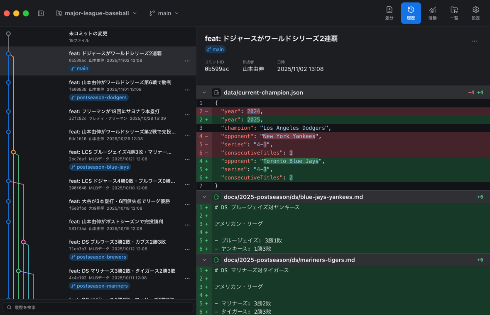
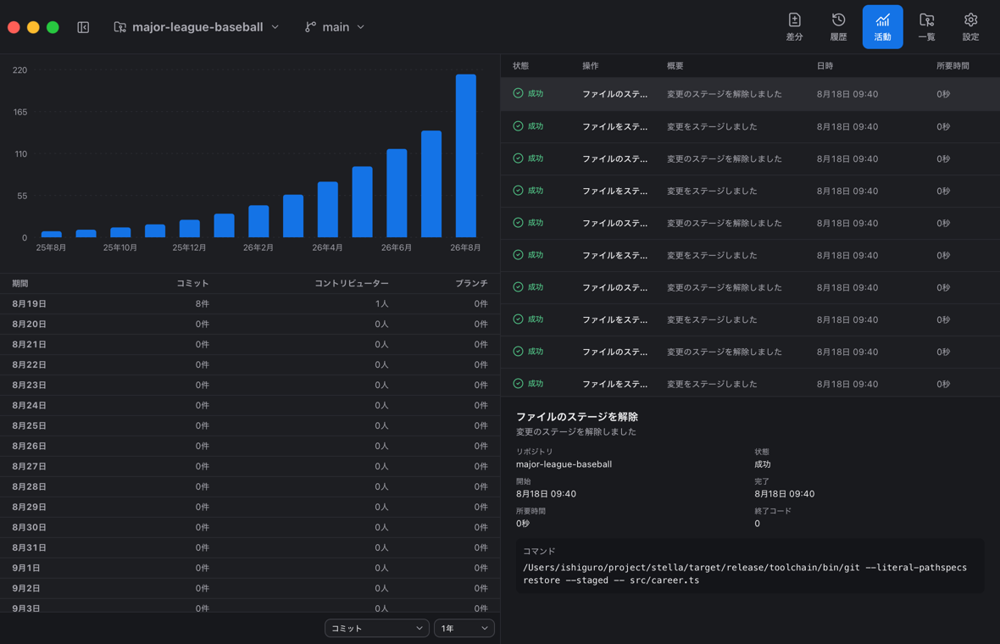
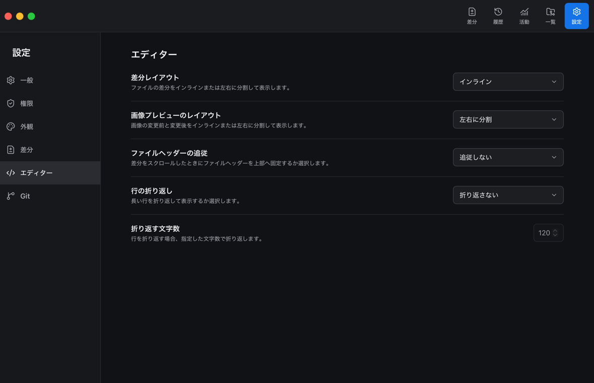

<h1 align="center">Stella</h1>

<p align="center">
  
</p>

<p align="center">ファイルの差分の確認に集中できるシンプルなGitクライアント</p>



## ✨ 機能

✅ ファイル、ハンク、行単位でファイルの差分の確認と編集ができます。  
✅ コミット、ブランチ、タグを確認し、検索できます。  
✅ コミット数、コントリビューター数、ブランチ数の推移を閲覧できます。  
✅ 言語や外観、文字サイズ、レイアウト、ステージの表示などを好みに合わせて設定できます。  

## 📦 インストール

> [!WARNING]
> このアプリは現在評価版です。  
> 将来的に破壊的な変更が入る可能性があります。  
> 操作やバグによって生じた損害について、作者は一切の責任を負いません。  

```sh
brew tap ishiguro-junya/stella https://github.com/ishiguro-junya/stella
brew install --cask ishiguro-junya/stella/stella
```

## 🌱 開発を始める

miseがインストール済みであれば、下記のコマンドで開発環境を準備してアプリを起動できます。  
詳しい開発手順は[コントリビュートガイド](CONTRIBUTING.md)を確認してください。  

```sh
mise install
mise run setup
mise run dev
```

## 🧰 コマンド

| コマンド | 内容 |
| --- | --- |
| `mise run setup` | 開発環境をセットアップする。 |
| `mise run reset` | 開発用リポジトリを初期状態へ戻す。 |
| `mise run dev` | アプリを開発モードで起動する。 |
| `mise run build` | アプリをビルドする。 |
| `mise run install` | アプリをインストールする。 |
| `mise run lint` | コードをリントチェックする。 |
| `mise run format` | コードをフォーマットする。 |
| `mise run test` | 全てのテストを実行する。 |
| `mise run test:unit` | 単体テストを実行する。 |
| `mise run test:integration` | 統合テストを実行する。 |
| `mise run test:e2e` | E2Eテストを実行する。 |
| `mise run test:visual-regression` | ビジュアルリグレッションテストを実行する。 |
| `mise run security` | セキュリティ検査を実行する。 |
| `mise run ci` | 全ての検査を実行する。 |
| `mise run screenshot` | スクリーンショットを生成する。 |
| `mise run update` | パッケージを最新にアップデートする。 |

## 📁 リポジトリ構成

```text
.
├── .github/workflows/      # Homebrew Caskを更新するGitHub Actions
├── .markdownlint-rules/    # リポジトリ固有のMarkdown検査
├── Casks/                  # Homebrew Caskの定義
├── app/                    # アプリ本体
│   ├── adapters/           # Tauriコマンドとフロントエンドの接続
│   ├── domain/             # Gitの型、操作、表示ルール
│   ├── features/           # 画面と機能単位の実装
│   ├── fixtures/           # フロントエンドとRustで共有するテストデータ
│   ├── i18n/               # i18nextの設定と翻訳カタログ
│   ├── native/             # RustバックエンドとTauri設定
│   │   ├── capabilities/   # Tauriの権限定義
│   │   ├── icons/          # アプリのアイコン
│   │   ├── infoplist/      # macOS向けのローカライズ情報
│   │   ├── licenses/       # バンドルする依存ライセンス
│   │   ├── src/            # Git操作、状態管理、Tauriコマンド
│   │   └── tauri*.conf.json # 共通、開発、テスト、更新用のTauri設定
│   ├── persistence/        # 利用者設定と操作履歴の保存
│   ├── test/               # テストコードと共通処理
│   │   ├── e2e/            # E2E、VRT、スクリーンショットテスト
│   │   └── unit/           # フロントエンド単体テストの共通設定
│   ├── theme/              # 外観と文字組みの制御
│   ├── ui/                 # 共通の画面部品
│   ├── App.tsx             # アプリの状態と画面遷移
│   ├── main.tsx            # フロントエンドの起動点
│   └── styles.css          # アプリ全体のスタイル
├── docs/                   # 開発ドキュメント
│   ├── architecture.md     # 内部構造
│   ├── release.md          # リリースと配布の手順
│   ├── review.md           # レビュー方針と完了基準
│   ├── security.md         # 安全性保証とセキュリティ検査
│   ├── specification.md    # 利用者から見える仕様
│   ├── testing.md          # テスト方針と実行方法
│   └── writing.md          # ドキュメントの配置と書き方
├── screenshots/            # スクリーンショットの保存先
├── scripts/                # 開発、検査、リリース用スクリプト
│   ├── available-port.mts  # 開発アプリとテストの空きポート探索
│   ├── available-port.test.mts # ポート探索の単体テスト
│   ├── create-updater-manifest.mts # 更新マニフェストの生成
│   ├── install-app.mts     # 構築したアプリのインストール
│   ├── mode-app.mts        # 用途別のmacOSアプリ名を持つ実行ファイル作成
│   ├── native-slot.mts     # worktree間で共有するネイティブ実行枠
│   ├── native-slot.test.mts # ネイティブ実行枠の単体テスト
│   ├── showcase-fixture.mts # 開発用リポジトリの準備と初期化
│   ├── tauri-hook.mts      # Tauriの開発起動と構築前処理
│   ├── toolchain.mts       # Gitツールチェーンの準備と検証
│   └── update-stella-cask.rb # Homebrew Caskの更新
├── .gitattributes          # Gitで扱うファイル属性
├── .gitignore              # Git管理外にするファイル
├── .markdownlint-cli2.jsonc # Markdown検査設定
├── .textlintrc.json        # 日本語ドキュメントの検査設定
├── CONTRIBUTING.md         # 開発への参加方法
├── DESIGN.md               # プロダクト設計の原則
├── LICENSE                 # アプリのライセンス
├── README.md               # 製品概要と開発の入口
├── THIRD_PARTY_NOTICES.md  # 第三者ソフトウェアのライセンス表示
├── Cargo.lock              # Rust依存の固定情報
├── Cargo.toml              # Rustワークスペースの定義
├── cog.toml                # コミットメッセージの検査設定
├── index.html              # Viteが読み込むHTML
├── knip.jsonc              # 未使用コードと依存の検査設定
├── lefthook.yml            # Gitフックの定義
├── logo.png                # 製品ロゴの原本
├── lychee.toml             # ドキュメント内リンクの検査設定
├── mise.toml               # 開発環境とタスクの定義
├── oxfmt.config.ts         # TypeScriptとCSSの整形設定
├── oxlint.config.ts        # TypeScriptの静的検査設定
├── package.json            # Node.js依存とパッケージ情報
├── pnpm-lock.yaml          # Node.js依存の固定情報
├── pnpm-workspace.yaml     # pnpmワークスペースの定義
├── taplo.toml              # TOMLの整形と検査設定
├── toolchain.lock.json     # 同梱するGitツールチェーンの固定情報
├── tsconfig*.json          # 用途別のTypeScript設定
├── vite.config.ts          # フロントエンドの開発・構築設定
├── vitest.config.ts        # 単体テスト設定
├── wdio.conf.ts            # E2E、VRT、スクリーンショット設定
├── .pnpm-store/            # pnpmのローカルキャッシュ（Git管理外）
├── dist/                   # Viteの構築物（Git管理外）
├── node_modules/           # Node.js依存（Git管理外）
├── target/                 # RustとTauriの構築物（Git管理外）
├── tmp/                    # テストデータと一時ファイル（Git管理外）
└── worktrees/              # 並行開発用のworktree（Git管理外）
```

## 🗺️ 画面遷移図

```text
アプリ起動
└── リポジトリ一覧ページ
    ├── リポジトリを追加ダイアログ
    ├── リポジトリ情報を変更ダイアログ
    ├── リポジトリを削除ダイアログ
    ├── リポジトリの場所を復旧ダイアログ
    ├── 設定ページ
    └── リポジトリを開く
        ├── 差分ページ
        │   ├── コミットダイアログ
        │   ├── プルダイアログ
        │   ├── プッシュダイアログ
        │   ├── ファイル編集
        │   └── 変更の破棄・未保存内容の確認ダイアログ
        ├── 履歴ページ
        │   ├── ブランチ作成ダイアログ
        │   ├── タグ作成ダイアログ
        │   ├── マージダイアログ
        │   ├── リベースダイアログ
        │   ├── チェリーピックダイアログ
        │   ├── リバートダイアログ
        │   └── リセットダイアログ
        ├── 活動ページ
        ├── リポジトリ切り替えダイアログ
        │   ├── リポジトリを追加ダイアログ
        │   ├── リポジトリ情報を変更ダイアログ
        │   └── リポジトリを削除ダイアログ
        ├── ブランチ切り替えダイアログ
        │   ├── ブランチ作成ダイアログ
        │   └── ブランチ削除の確認ダイアログ
        ├── リポジトリ一覧ページ
        └── 設定ページ
```

### ファイル編集の画面



### 履歴の画面



### 活動の画面



### 設定の画面



## 📚 ドキュメント

- [AGENTS.md](https://github.com/ishiguro-junya/ai-agent-guideline/blob/main/AGENTS.md)
- [コントリビュートガイド](CONTRIBUTING.md)
- [デザイン](DESIGN.md)
- [サードパーティーに関する通知](THIRD_PARTY_NOTICES.md)
- [仕様](docs/specification.md)
- [アーキテクチャ](docs/architecture.md)
- [レビュー](docs/review.md)
- [セキュリティ](docs/security.md)
- [テスト](docs/testing.md)
- [ドキュメントの書き方](docs/writing.md)
- [リリース手順](docs/release.md)

## 🧩 エージェントスキル

- [stella-develop](.agents/skills/stella-develop/SKILL.md)
- [mattpocock/skills](https://www.skills.sh/mattpocock/skills)
- [ponytail](https://www.skills.sh/dietrichgebert/ponytail/ponytail)
- [natural-japanese](https://www.skills.sh/coji/natural-japanese/natural-japanese)
- [stop-ai-slop-jp](https://www.skills.sh/ikora128/stop-ai-slop-jp/stop-ai-slop-jp)
- [vercel-react-best-practices](https://www.skills.sh/vercel-labs/agent-skills/vercel-react-best-practices)
- [frontend-design](https://www.skills.sh/anthropics/skills/frontend-design)

## 🔗 参考リンク

- [mise](https://mise.jdx.dev/)
- [tsx](https://github.com/privatenumber/tsx)
- [Tauri](https://github.com/tauri-apps/tauri)
- [Oxc](https://oxc.rs/)
- [Knip](https://knip.dev/)
- [markdownlint-cli2](https://github.com/DavidAnson/markdownlint-cli2)
- [textlint](https://github.com/textlint/textlint)
- [@textlint-ja/textlint-rule-preset-ai-writing](https://github.com/textlint-ja/textlint-rule-preset-ai-writing)
- [Lychee](https://github.com/lycheeverse/lychee)
- [Lefthook](https://lefthook.dev/)
- [Homebrew](https://brew.sh/ja/)

## ⚖️ ライセンス

[Sustainable Use License 1.0](LICENSE)
